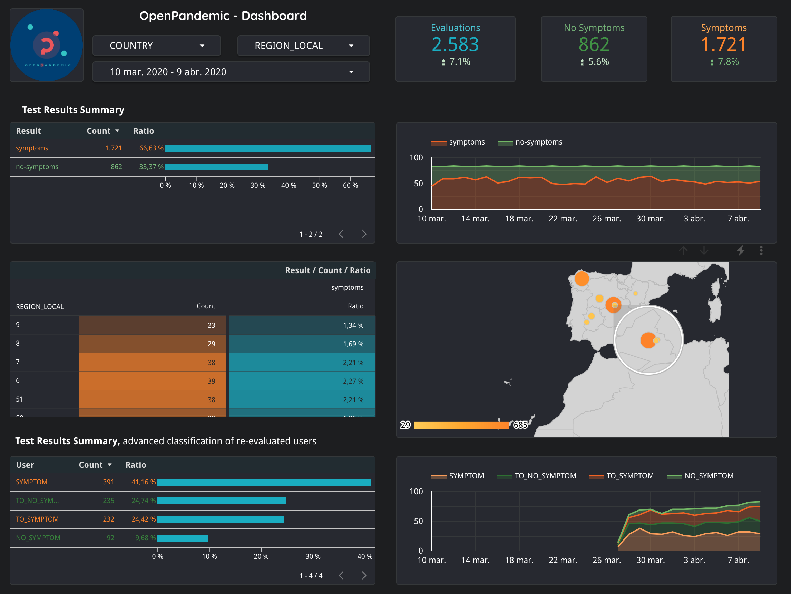

<p align="center">
  <a href="http://www.openpandemic.io"></a>
  <h3 align="center">Openpandemic - Analytics</h3>
  <p align="center">
    
  </p>
</p>

---

This is an opensource initiative to analyze pandemic diseases, such as coronavirus (COVID-19) for example. It's a complementary project of [openpandemic-app](https://github.com/OpenPandemic/openpandemic-app) and [openpandemic-back](https://github.com/OpenPandemic/openpandemic-back).

Whenever we can, we will use containers for all the functionality, thus ensuring reproducibility in any environment.

## Requirerements:

- Make (gcc).
- Docker (17+).
- Google Cloud Platform (GCP) project access.
- Python 3.8 (pipenv)

## Get starting with GCP

We need to have a GCP project and all needed APIs enabled beforehand.

You could use the official gcloud command client, as you know, but we encourage you to use it within docker containers.

To authenticate with GCP credentials create a `.env` file with the reserved environment variables and set up the suitable values:

```bash
GOOGLE_CLOUD_PROJECT="openpandemic-analytics"
GOOGLE_APPLICATION_CREDENTIALS="<path>/openpandemic-analytics.json"
```

Now we can run a docker container which is authenticated to get bigquery command client ready for action:

````bash
make gcloud-bastion
```` 

Now you can use the shell through the container (type `make bq-`+tab to discover more aliases):

````bash
make bq-shell
```` 

## Data 

In order to use the data provided by the project `openpandemic-back`, you need to get access to the regarding BigQuery tables (unless these tables are public)

### Generate test data

A lot of times we need data to get started with analytic tasks, so we could use synthetic data (not always), for this reason we've add a fake provider.

To generate `fake data` for covid19 symptoms evaluations we could use the python module:

```bash
pipenv run python -m openpandemic.fake.fake_data -h
```

If we want to generate data for Spain evaluations, for example: 5000 rows with 3333 re-evaluated users in 60 days, type next command:

```bash
pipenv run python -m openpandemic.fake.fake_data -nrows 5000 -nreval 3333 -ndays 60 -df data/ES/fake_data_es_v1.json
```

The output of that command execution is a `data/ES/fake_data_es_v1.json`, regarding the Bigquery data schema `data/bq_data_schema_v1.json` (dafault value of command above)


#### Load data to Bigquery

You could upload generated data to one table on Bigquery, just use the suitable command or use the humble script:

```bash
pipenv run python -m openpandemic.bq.load_data -h 
```

```bash
pipenv run python -m openpandemic.bq.load_data -df data/ES/fake_data_es_v1.json -d openpandemic_test -t data_test_es_v1

Loading .env environment variables...
2020-04-14 01:09:26,295 - openpandemic [load_fake_data.py:19] - INFO - Created dataset openpandemic-analytics.openpandemic_test
2020-04-14 01:09:26,561 - openpandemic [load_fake_data.py:35] - INFO - Table openpandemic-analytics.openpandemic_test.data_test_es_v1 was recreated.
2020-04-14 01:09:26,729 - openpandemic [load_fake_data.py:39] - INFO - Created table: /projects/openpandemic-analytics/datasets/openpandemic_test/tables/data_test_es_v1
2020-04-14 01:09:30,469 - openpandemic [load_fake_data.py:57] - INFO - Loaded 5000 rows.
```

or by using command client through our docker bastion:
````bash
make bq-create-dataset bq-create-table bq-upload-data
````

### Download data from Bigquery

In many situations we want to download data from Bigquery to try data in another environment ( :computer: ).
For this situations we provide this useful python module:

```bash
pipenv run python -m openpandemic.bq.download_data -h
```

Now we could import this CSV files in Google Spreadsheet, Excel or other many tools.

For example:

```bash
export TABLE_ID=openpandemic-analytics.openpandemic_test.data_test_es_v1
pipenv run python -m openpandemic.bq.download_data -s ";" -f "data_test_es_v1.csv" -q "$(envsubst < data/sql/data_short.sql)"
```

We've placed some files in [a public Google Drive folder for anyone](https://drive.google.com/open?id=1T8uLUfAj6XRD-kJNTy2buix5QJEJxW3n) which wants to play with them. 

## Notebooks

Take a look at our [notebooks section](notebooks) to get more information.

## Dashboard information

There are a lot of tools for BI or make custom dashboards, but for now we use Data Studio
because of the amount of data source connectors, among others, for example: custom CSV, SpreadSheets, BBDD, Bigquery, ... (and, of course, community connectors as well)

### Data Studio

We've created a Data Studio report to outline the most interesting information about pandemics.



[Here we have the shared report](https://datastudio.google.com/reporting/fe8c2d0f-3531-48d5-932a-e621fbfbd0a5) using the spreadsheets placed in the link above so that anyone can try it out.

## Cleaning

Remove all resources:

```bash
make clean-clean
```

## Task list

- [x] PoC data on BigQuery & Data Studio
- [ ] MLkit Firestore
- [ ] AutoML Bigquery
- [ ] AI on edge
